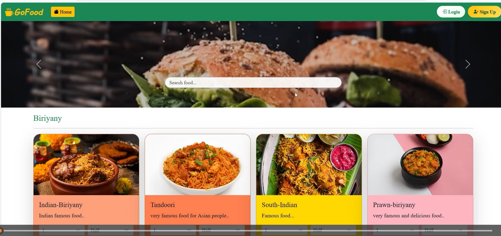
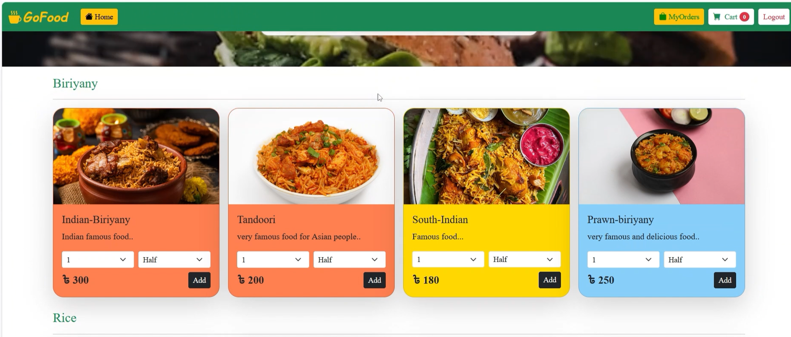
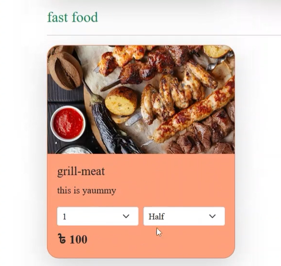
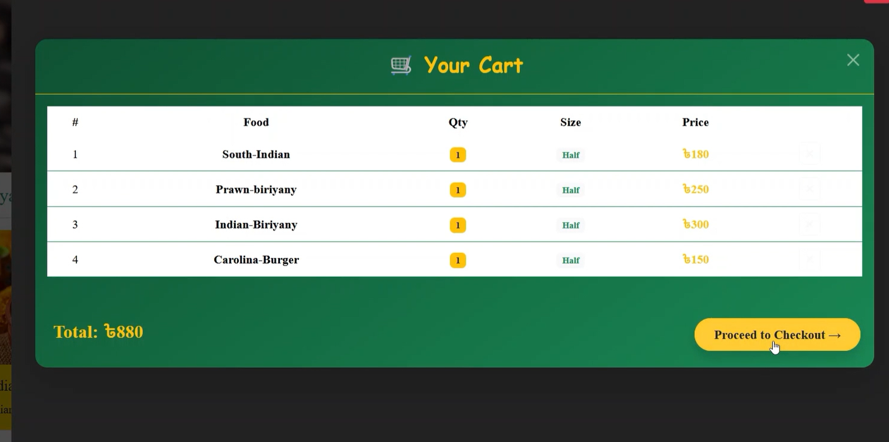
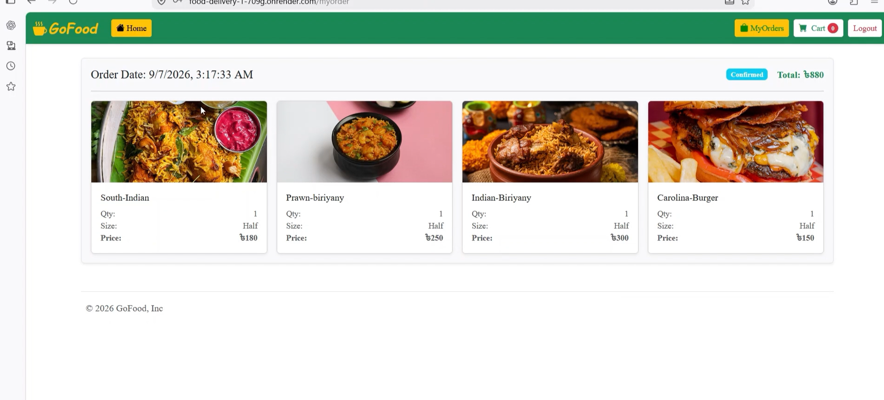
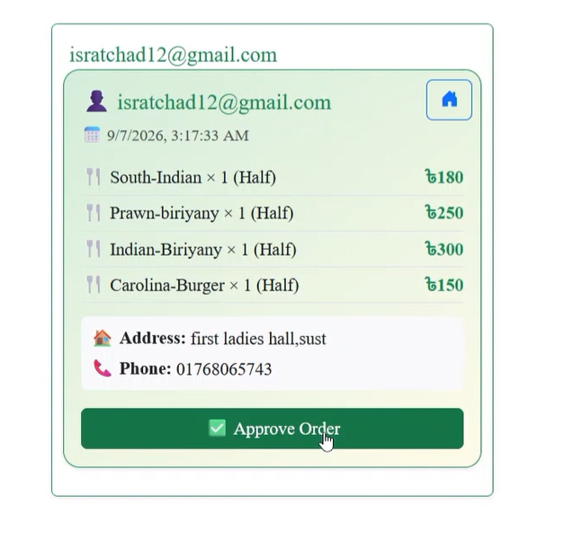

# 🍔 Food Delivery Application

<p align="center">
  A full-stack food delivery web application for browsing food, managing carts,
  placing orders, and handling food orders through an admin panel.
</p>

<p align="center">
  <a href="https://github.com/ichadni/FOOD_DELIVERY">
    
  </a>
  
  
  
  
  
</p>

---

## 📌 Overview

**Food Delivery Application** is a full-stack web application developed to provide a convenient online food ordering experience.

Users can browse food items, select products, manage their shopping cart, proceed through checkout, confirm orders, and view their order history.

The application also includes an **Admin Panel** for adding food items and managing customer orders.

The project uses a **React + Vite frontend** and a separate **Node.js + Express backend**, with **MongoDB/Mongoose** used for database operations.

---

## ✨ Features

### 👤 User Features

- 🔐 User registration
- 🔑 User login
- 🏠 Home page
- 🍔 Browse food items
- 📂 Food categories
- 🛒 Add items to cart
- ➕ Increase/decrease quantity
- 🗑️ Remove items from cart
- 💰 View cart total
- 🧾 Checkout
- ✅ Confirm orders
- 📦 View previous orders

### 👨‍💼 Admin Features

- 🔐 Admin access
- 📊 Admin interface
- ➕ Add food items
- 🍔 Manage food data
- 📋 View customer orders
- ✅ Approve/process orders

### ⚙️ Backend Features

- REST API architecture
- User API routes
- Food data API routes
- Order API routes
- Admin API routes
- Order approval routes
- MongoDB integration
- Mongoose models
- Password hashing
- JWT-based authentication support
- Request validation
- Email/OTP-related backend dependencies

---

# 🖥️ Application Preview

> Screenshots from the application can be added here.

### 🏠 Home Page



### 🍔 Food Menu



### 🛒 Shopping Cart



### 🧾 Checkout



### 📦 My Orders



### 👨‍💼 Admin Panel



---

# 🏗️ System Architecture

```text
                    ┌─────────────────────┐
                    │       User          │
                    └──────────┬──────────┘
                               │
                               ▼
                    ┌─────────────────────┐
                    │   React Frontend    │
                    │      + Vite         │
                    └──────────┬──────────┘
                               │
                               │ REST API
                               ▼
                    ┌─────────────────────┐
                    │ Node.js + Express   │
                    │      Backend        │
                    └──────────┬──────────┘
                               │
                               ▼
                    ┌─────────────────────┐
                    │      MongoDB        │
                    │     + Mongoose      │
                    └─────────────────────┘
                               ▲
                               │
                    ┌──────────┴──────────┐
                    │     Admin Panel     │
                    │ Food & Order Mgmt.  │
                    └─────────────────────┘
